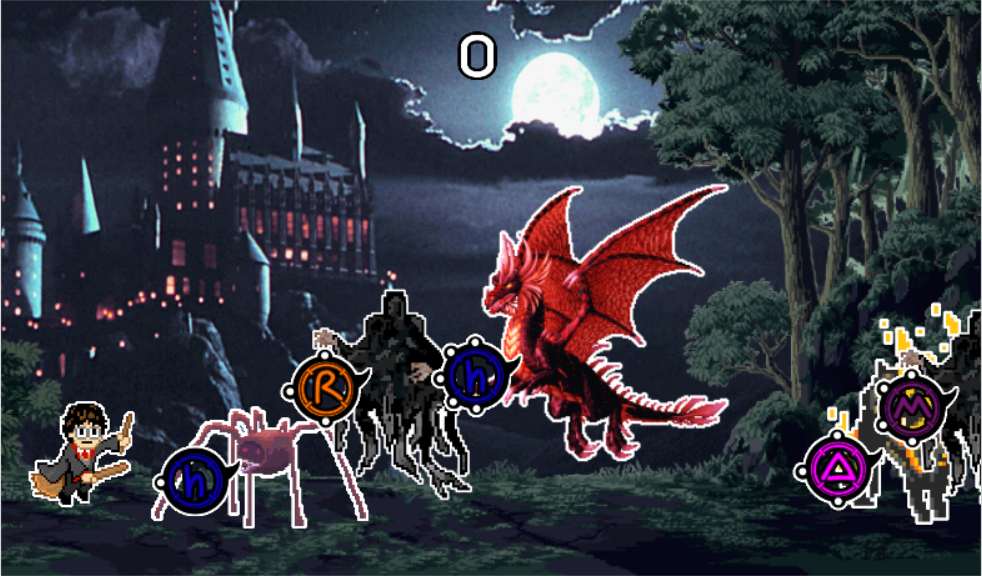
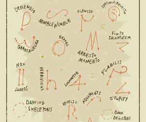
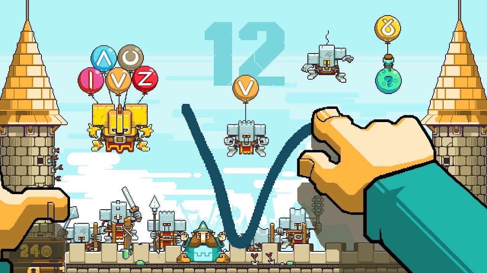

# Spell Caster

Đồ án môn Lập trình trực quan, trường ĐH Công nghệ Thông tin  - ĐH Quốc Gia TP Hồ Chí Minh

## Sơ lược

Đề tài là một game nhỏ mang tên “Spell Caster”. Trong game, người chơi sẽ
“cast spells” để chống lại đội quân quái vật đang tràn tới bằng cách vẽ phép
được hiển thị trong những vòng tròn bên cạnh quái vật và không để quái vật
vượt khỏi vị trí của mình.

### Ideas
* [HarryPotter](https://en.wikipedia.org/wiki/Harry_Potter) - Về bối cảnh, dễ nhận ra game lấy ý tưởng từ tựa truyện Harry Potter, cả những hình vẽ phép của game cũng dựa theo tác phẩm.

* [MagicTouch](http://nitrome.wikia.com/wiki/Magic_Touch:_Wizard_for_Hire) - Về gameplay, game lấy ý tưởng từ tự game MagicTouch của Nitrome. Trong game này người chơi cũng là một phù thủy chống lại quái vật bằng cách vẽ phép.

## Built With

* [Tesseract OCR 3.0.2](https://github.com/tesseract-ocr/tesseract) - Engine sử dụng cho việc nhận diện chữ viết.

### Prerequisites

* [.NET Framework 4.6.1](https://www.microsoft.com/en-us/download/details.aspx?id=49981)

### Installing

Chạy một trong hai file setup trong thư mục BaoCao để cài đặt.

## Authors

* **Nguyễn Đình Phú Thịnh** - [tligodsp](https://github.com/tligodsp)

## Acknowledgments

* Xin gửi lời cảm ơn thầy Huỳnh Tuấn Anh đã tạo điều kiện và nhiệt tình hướng dẫn để đồ án này có thể được hoàn thành.

